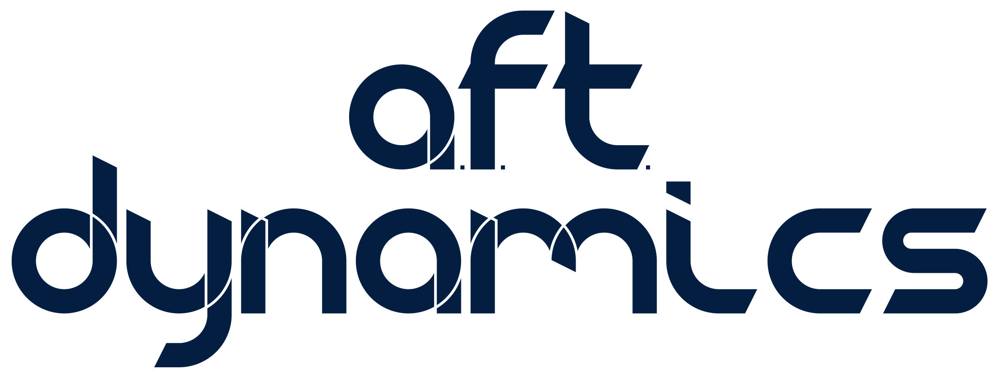

When I tell people about AFTdynamics, one of the first questions I'm asked is:

> What does AFT stand for?

Read on to find out!

<!-- truncate -->

Looking at the logo, you'll probably notice the dots after each letter.

Here's what each one stands for:

- **A**ero
- **F**luid
- **T**hermo

That's it!

These are the three pillars of my technical career so far. My PhD studies surrounded internal aerodynamics of turbofan engine exhaust systems. That required a whole lot of fluid dynamics and thermodynamics knowledge.

Since then, I've been involved in the preliminary design of a few other gas turbine engines. One was a 3-spool recuperated and intercooled engine that used bio-gas to generate power for an air-blower. Another was a two-spool recuperated turboprop engine.

For each of those engines I was responsible for much of the architecture at the higher level, then performing CFD (computational fluid dynamics) analysis from 1-D models up to advanced 3-D models with full turbulence and conjugate heat transfer considerations when we got into detailed designs.

- Aerodynamics
- Fluid dynamics
- Thermodynamics

These are also the technical pillars of AFTdynamics' research and development efforts.

Plus there's a bit of a double entendre. We're making rocket engines and they go on the aft end of the vehicle.

Stay tuned as the company grows and to learn more about what we'll be doing in the world of rocketry and space launch!
